<div align="center">

<!-- АНИМИРОВАННЫЙ БАННЕР (SVG) -->


</div>

---

## 👨‍💻 О себе

Изучаю разработку на **1С:Предприятие 8.3** — создаю конфигурации с нуля и разбираю платформу от справочников до регистра расчётов.

- 🔭 Сейчас работаю над учебными конфигурациями для портфолио
- 📖 Изучаю: управляемые формы, клиент-серверное взаимодействие, СКД
- 💡 Цель: стать 1С-разработчиком и получить сертификат «1С:Специалист»
- 🛠️ Инструменты: Конфигуратор 1С, EDT, Консоль запросов

---

## 🗂️ Проекты

### 🏪 [1С:Купец](https://github.com/golden-platypus/1c-kupets)
> Комплексная конфигурация для автоматизации торгового предприятия

```
Подсистемы:  Торговый учёт · НСИ · Кадровый учёт · Бухгалтерский учёт
Документы:   7 шт.  (Расходная/Приходная накладная, ПКО, ЗП и др.)
Регистры:    4 типа (накопления, сведений, бухгалтерии, расчётов)
Отчёты:      4 шт.  (Продажи, Остатки, ЗП, ОСВ)
```

**Ключевые решения:** план счетов + двойная запись · расчёт зарплаты по видам расчёта · функциональная опция складского учёта · ролевая модель доступа

---

### 🍽️ [Управление нашей кухней](https://github.com/golden-platypus/1c-unk)
> Первая конфигурация. Учёт продуктов от покупки до приготовления блюда

```
Справочники: 3 шт.  (Продукты с рецептами, МестаХранения, Магазины)
Документы:   3 шт.  (Покупка, Потребление, ПриготовлениеПродуктов)
Регистры:    2 шт.  (Остатки продуктов, Затраты по магазинам)
Отчёты:      1 шт.  (Остатки на СКД)
```

---

## 🛠️ Стек

<div align="center">

| Платформа | Объекты | Инструменты |
|:---:|:---:|:---:|
| 1С:Предприятие 8.3 | Справочники, Документы | Конфигуратор |
| Управляемое приложение | Регистры всех видов | EDT |
| Интерфейс Такси | СКД, Отчёты | Консоль запросов |
| Клиент-сервер | Роли и права | Отладчик |

</div>

---

## 📊 Что изучил

```bsl
// Встроенный язык 1С
Процедура ОбработкаПроведения(Отказ, РежимПроведения)
    Для Каждого Строка Из ТаблицаТоваров Цикл
        Движение = Движения.ОстаткиНоменклатуры.Добавить();
        Движение.ВидДвижения = ВидДвиженияНакопления.Расход;
        Движение.Количество  = Строка.Количество;
    КонецЦикла;
КонецПроцедуры

// Язык запросов 1С
ВЫБРАТЬ
    Остатки.Номенклатура,
    СУММА(Остатки.КоличествоОстаток) КАК КоличествоОстаток
ИЗ
    РегистрНакопления.ОстаткиНоменклатуры.Остатки() КАК Остатки
СГРУППИРОВАТЬ ПО
    Остатки.Номенклатура
```

---

## 📈 Прогресс изучения

```
Встроенный язык 1С     ████████░░  78%
Язык запросов          ███████░░░  72%
СКД (отчёты)           ██████░░░░  65%
Регистры накопления    ████████░░  80%
Управляемые формы      ██████░░░░  60%
Бухгалтерский учёт     █████░░░░░  50%
Расчёт зарплаты        █████░░░░░  50%
```

---

## 📫 Связаться

<div align="center">

[](https://t.me/@gelbesSchwein)
[](mailto:gelbesSchwein@yandex.ru)

</div>

---

<div align="center">
<sub>🟡 Открыт к стажировкам и junior-позициям по 1С</sub>
</div>
